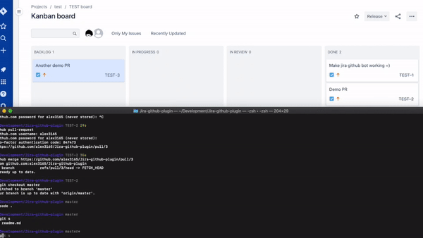

# Github drive Jira



This project contain 2 AWS lambda which listen to Github webhook and update Jira given the following actions mapping:

- Create branch (branch name should have Jira ticket number) will update Jira task to "In Progress" status
- Create a Pull Request will update Jira status to "In Review"
- Merge a Pull Request will update Jira status to "Done"

## How to use

create a `.env` file with the following environment variables:

```shell
TOKEN=YOUR_JIRA_TOKEN
JIRA_DOMAIN=YOUR_JIRA_DOMAIN
USERNAME=YOUR_JIRA_USERNAME

# The following environment variables should be named from your Jira configuration
GITHUB_PR_OPEN="In Review"
GITHUB_BRANCH_OPEN="In Progress"
GITHUB_PR_MERGED="Done"
```

Install dependencies:

```shell
npm install
```

Deploy the lambda to your AWS distribution:

```
serverless deploy
```

Then:

- Create an API Gateway and expose the 2 lambda endpoints to get 2 urls
- Configure webhooks on your Github repository to point to the lambda accordingly, `create_branch` event should point to `branch-lambda.js` and `pull_request` events should point to `pr-lambda.js`

### (Bonus) Prepend commit messages with branch name

Install pre-commit on your local machine:

```
brew install pre-commit
```

Add a `.pre-commit-config.yaml` file to your project with the following content:

```yaml
repos:
  - repo: https://github.com/milin/giticket
    rev: "868d937"
    hooks:
      - id: giticket
        args: ["--format=[{ticket}] {commit_msg}"] # Optional
```
